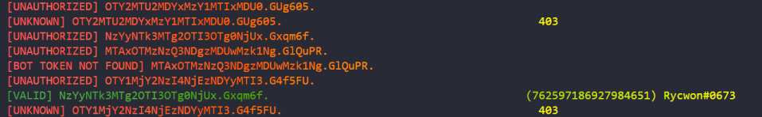

# Discord token checker!

## This is for educational purposes only. Please dont hammer discord's API with this 😩

<br>

# Usage:

1. ### Clone the repo
```bash
git clone https://github.com/ddjerqq/discord_token_checker.git
```
2. ### Put tokens inside tokens.txt
3. ### Install requirements.txt
```bash
pip install -r requirements.txt
```
4. ### Run the module with python
### Note: you have to be in the same dir as the src folder!
```bash
py src
```



5. ### check output of valid.txt

<br>
<br>

# stop being a skid! 
## [here](https://www.pythondiscord.com/resources/) are some helpful resources to get you started learning Python!


<br>

# FAQ

* how do I use this tool?
* > check below

<br>

* what kind of proxies work best?
* > HTTP proxies with low latency

<br>

* what kind of proxies work best?
* > HTTP proxies with low latency

<br>

* where can I get `BOT_TOKEN`?
* > Make a bot [here](https://discord.com/developers/applications)

<br>

* My question is not listen on here
* > submit an issue and I will make sure to help you out... <br>
  > alternatively fix it yourself and make a PR 🖤

